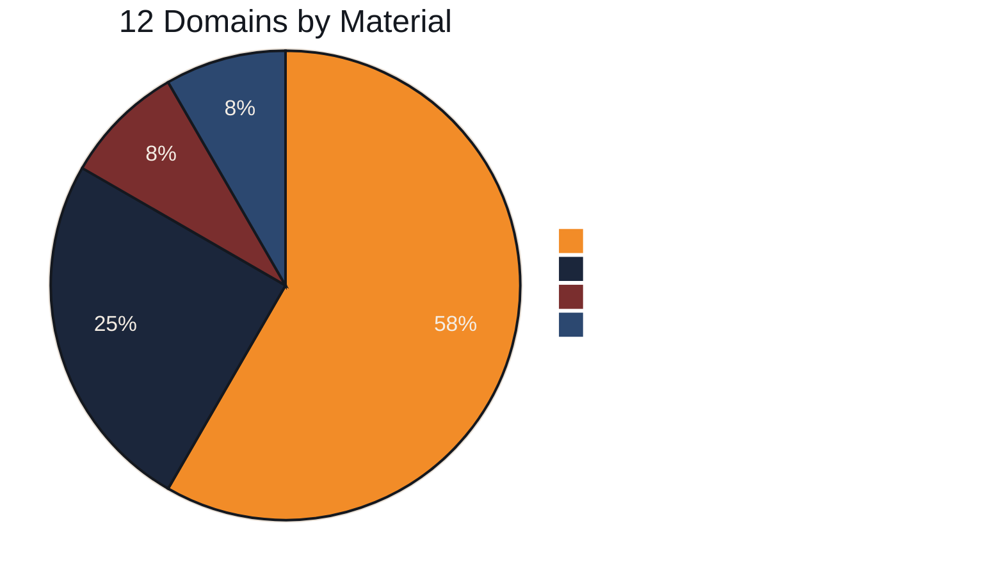
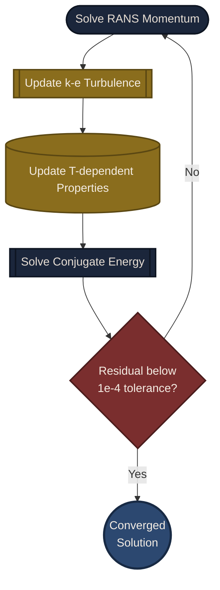
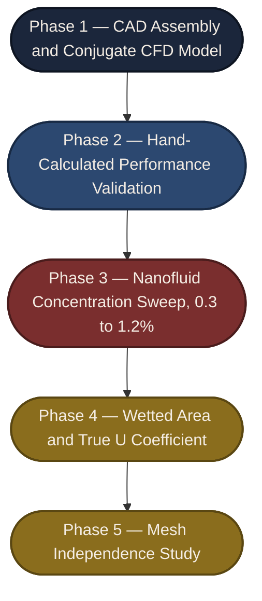

yghvggdsgcmkhjz
<!--------|---------|---------|------------------- Main Banner  -------------------------------------------------------------->

  

<h3 align="center">CAD Design and CFD Simulation of a Helically Swirled Tube Heat Exchanger Cooled by a Hybrid Nanofluid</h3>

  
  
  

  
  
  
  

 

 

## Overview

This Project is a complete CAD-to-CFD study of a compact double pipe heat exchanger whose inner tube follows a helical, swirled centreline instead of a straight axis. A hybrid **Al₂O₃–CuO–CNT nanofluid** flows through the swirled core as the hot stream, exchanging heat through a steel tube wall with plain water flowing countercurrently in the annular shell space.

The full assembly, imported from SolidWorks, was solved in COMSOL Multiphysics as a steady, three dimensional, **conjugate heat transfer** problem: turbulent RANS flow (standard k–ε model) coupled to the energy equation across both fluid domains and the surrounding solid, with no assumed film coefficient anywhere in the model. Every reported performance number, heat duty, log mean temperature difference, overall conductance, and effectiveness, is either a direct field output or a hand calculation built on top of it and cross validated by two independent thermal design methods.

 

## Results at a Glance

| Heat Duty | Effectiveness | Overall Conductance | Pressure Penalty |
|:---:|:---:|:---:|:---:|
| **4.14 kW** | **75.3 %** | **220 W/K** | **≈ 2 Pa** |

 

<table>
  <tr>
    <td align="center">
      
       
      <b>CAD Model</b>
    </td>
    <td align="center">
      
       
      <b style="color:white;">CAD Inner View</b>
    </td>
  </tr>
  
  <tr>
    <td align="center">
      
       
      <b>Mesh</b>
    </td>
    <td align="center">
      
       
      <b style="color:white;">Mesh Inner View</b>
    </td>
  </tr>

  <tr>
    <td align="center">
      
       
      <b>Temperature</b>
    </td>
    <td align="center">
      
       
      <b style="color:white;">Temperature Inner View</b>
    </td>
  </tr>

  <tr>
    <td align="center">
      
       
      <b>Velocity</b>
    </td>
    <td align="center">
      
       
      <b style="color:white;">Velocity Streamline</b>
    </td>
  </tr>
    <tr>
    <td align="center">
      
       
      <b>Inner Fluid Velocity</b>
    </td>
    <td align="center">
      
       
      <b style="color:white;">Outer Fluid Velocity</b>
    </td>
  </tr>

  <tr>
    <td align="center">
      
       
      <b>Pressure</b>
    </td>
    <td align="center">
      
       
      <b style="color:white;">Pressure Inner View</b>
    </td>
  </tr>
    <tr>
    <td align="center">
      
       
      <b>Temp & Fluid Flow</b>
    </td>
    <td align="center">
      
       
      <b style="color:white;">Temp & Inner Fluid Flow</b>
    </td>
  </tr>
      <tr>
    <td align="center">
      
       
      <b>Velocity Field</b>
    </td>
    <td align="center">
      
       
      <b style="color:white;">Temp & Inner Fluid Flow</b>
    </td>
  </tr>
</table>

## How It Works

Every stage feeds the next: geometry defines where materials sit, materials and physics define the mesh resolution needed, and the solved fields are what every hand calculation in this repository is built from.

 

## Domain Breakdown

**Hot stream**: Al₂O₃–CuO–CNT hybrid nanofluid, 1.2% concentration, swirled inner tube
**Cold stream**: Water, annular shell passage
**Structure**: Steel AISI 4340 tube wall and baffles, acrylic outer shell and headers

 

## Governing Equations

| Equation | Expression |
|---|---|
| Continuity | ∇·(ρ **u**) = 0 |
| Momentum (RANS) | ρ(**u**·∇)**u** = −∇p + ∇·[(μ + μₜ)(∇**u** + ∇**u**ᵀ)] |
| k–ε Turbulence | μₜ = ρ Cμ k² / ε |
| Conjugate Energy | ρ Cp **u**·∇T = ∇·(k∇T)  in fluid, ∇·(kₛ∇T) = 0 in solid |

The fluid and solid energy equations are coupled at every internal boundary through continuity of temperature and heat flux, no convective film coefficient is prescribed anywhere, the wall to fluid heat transfer coefficient is an emergent result of the coupled solution.

 

## Coupled Solver Loop

 

## Materials

| Property | Steel AISI 4340 | Acrylic Plastic | Water (cold) | Al₂O₃–CuO–CNT 1.2% (hot) |
|---|---|---|---|---|
| Density (kg/m³) | 7850 | 1190 | 997 | 1021.7 |
| Specific heat, Cp (J/(kg·K)) | 475 | 1470 | 4182 | 3997 |
| Thermal conductivity, k (W/(m·K)) | 44.5 | 0.18 | 0.613 | 1.003 |

The 1.2% nanofluid raises thermal conductivity by ≈ 35% over the base fluid across the 0.3–1.2% concentration range defined in the model library.

 

## Boundary Conditions

| Boundary | Flow Condition | Thermal Condition |
|---|---|---|
| Hot inlet | Mass flow = 8 L/min | 65.0 °C |
| Hot outlet | Pressure = 0 Pa (gauge) | Convective outflow |
| Cold inlet | Mass flow = 2 L/min | 25.0 °C |
| Cold outlet | Pressure = 0 Pa (gauge) | Convective outflow |
| Tube wall | No slip, wall functions | Conjugate, continuity of T and flux |
| External casing | Not applicable | Thermally insulated |

 

## Performance Summary

| Metric | Value | Method |
|---|---|---|
| Heat duty, Q | 4.14 kW | Average of hot/cold energy balance (1.4% closure) |
| Log mean temperature difference | 18.83 K | Counter current LMTD |
| Overall conductance, UA | 220.0 W/K | Q / ΔT_lm |
| Overall conductance, UA (cross check) | 221.7 W/K | ε–NTU method (0.8% agreement) |
| Effectiveness, ε | 75.3% | ε = Q / Q_max |
| Hot side pressure change | ≈ 2.39 Pa | Boundary averaged, CFD |
| Cold side pressure change | ≈ 1.22 Pa | Boundary averaged, CFD |

 

## Roadmap

 

## Tech Stack

Built in **COMSOL Multiphysics** using the Heat Transfer Module and CFD Module: Heat Transfer in Solids and Fluids, Turbulent Flow (k–ε), and the Nonisothermal Flow multiphysics coupling, solved on a physics controlled tetrahedral mesh with five layer boundary layers at every fluid wall. Geometry authored in SolidWorks and imported as a parasolid CAD file. Post-processing and hand calculations documented in the full report.

 

## Getting Started

1. Clone the repo and open `model/vortherm.mph` in COMSOL Multiphysics (Heat Transfer Module + CFD Module required).
2. Review the Global Definitions node for the four operating parameters: `m_hot`, `T_hot`, `m_cold`, `T_cold`.
3. Run the Mesh sequence, then run the Stationary study under Study 1.
4. Open the Results node to reproduce the temperature, velocity, and pressure plots.
5. Cross check the boundary values against Section 6 and Section 7 of `docs/report.pdf`.

 

## Contributing

1. Fork the repo
2. Create a branch: `git checkout -b feature/your-feature`
3. Commit your changes
4. Open a pull request

 

## References

Incropera, F. P., DeWitt, D. P., Bergman, T. L., and Lavine, A. S. *Fundamentals of Heat and Mass Transfer.* John Wiley and Sons.
COMSOL Multiphysics. *Heat Transfer Module and CFD Module User's Guides.* COMSOL AB.
Launder, B. E., and Spalding, D. B. "The Numerical Computation of Turbulent Flows." *Computer Methods in Applied Mechanics and Engineering.*
Kakac, S., Liu, H., and Pramuanjaroenkij, A. *Heat Exchangers: Selection, Rating, and Thermal Design.* CRC Press.

 

## License

Distributed under the MIT License. See `LICENSE` for details.

 

Built by <a href="https://github.com/fraisasghar">Frais Asghar</a>

If this project was useful to you, consider giving it a star. ⭐

<p3 align="center">Built for the Thermal Engineering &amp; Simulation community &nbsp;&middot;&nbsp; Happy building</p3>

